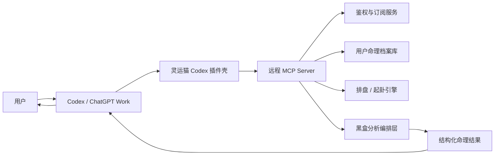
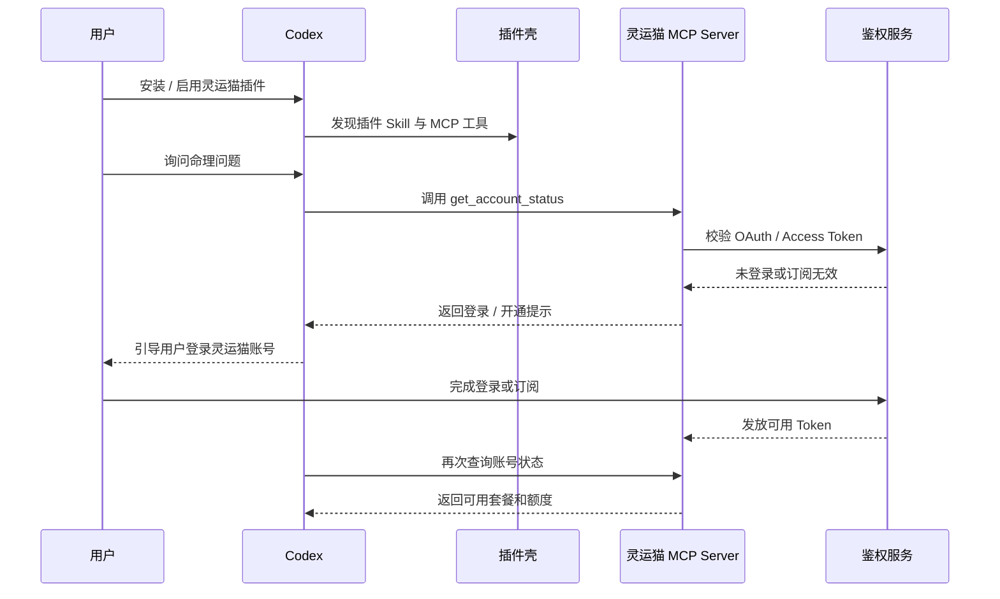
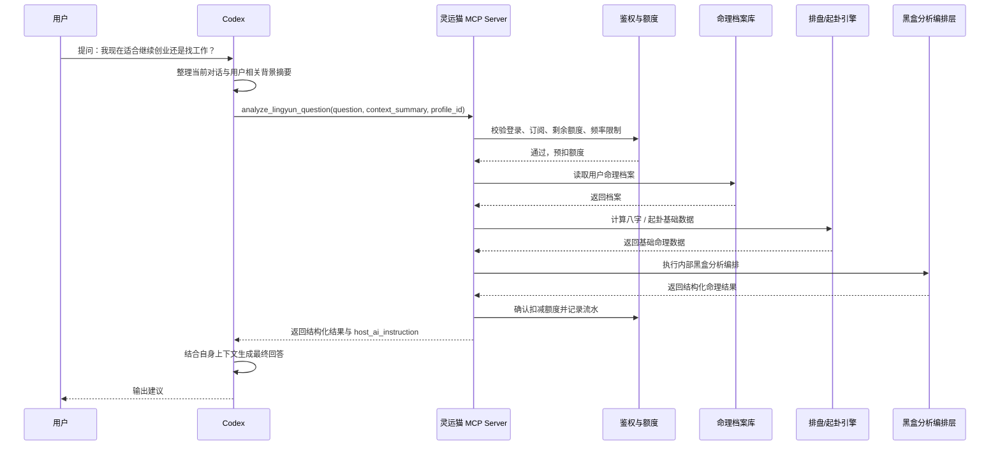
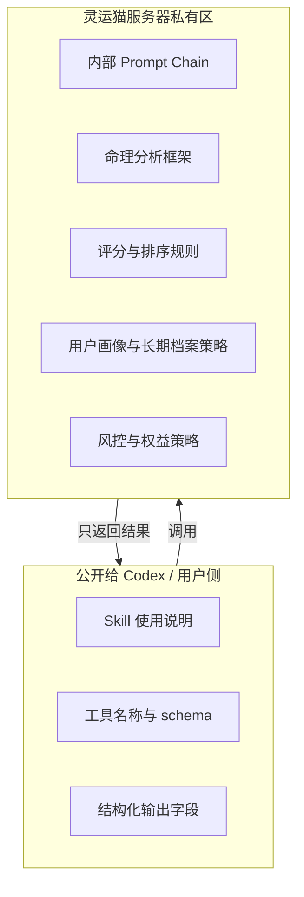
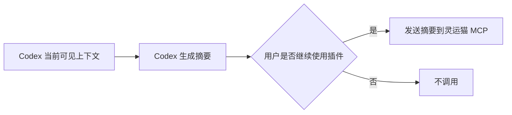

# 灵运猫 Codex 插件壳 MVP 架构设计

## 0. 当前口径校正

这份文档来自最早的产品讨论，标题里写的是 Codex 插件壳，但真实目标比“本地 Codex MCP”更大：

```text
做一个线上可安装的灵运猫插件，让普通用户在 ChatGPT/Codex 等主流 AI 聊天或工作流入口里调用灵运猫能力，不需要在本机跑 MCP 服务。
```

当前阶段目标不是本地 MCP。当前阶段目标是：

- 有一个公网 HTTPS MCP 服务。
- 用户可以从受支持的插件入口安装或连接灵运猫。
- 插件调用灵运猫远程服务完成排盘、起卦、鉴权、额度和后续黑盒分析。
- 主流 AI 宿主负责理解用户上下文和最终表达。
- 灵运猫内部框架、Prompt Chain、评分规则、权益风控不进入插件包。

本地 MCP 只允许作为开发验证和 fallback，不应被当成产品终点。

当前实现状态维护在：

```text
C:/Users/11483/Documents/GitHub/mystic-mcp-plugin/docs/product-goal-and-status.md
```

## 1. 目标

先验证一个最小可行方向：让用户在 Codex 里使用灵运猫能力，但不把灵运猫内部分析框架、Prompt Chain、评分规则和业务策略暴露给 Codex 或用户本机。

核心定位：

- Codex 负责理解用户上下文、整理当前问题、生成最终自然语言回答。
- 灵运猫负责命理数据、排盘、起卦、订阅鉴权、结构化分析结果。
- 插件壳只负责让 Codex 知道什么时候调用灵运猫、如何传参、如何使用返回结果。

## 2. 非目标

当前阶段不做：

- 不细化八字、卦、流年、合盘等内部分析框架。
- 不在插件包里放核心 Prompt。
- 不试图后台读取 Codex 全量聊天历史或用户记忆。
- 不让灵运猫后端依赖用户的 Codex 订阅去直接调用 OpenAI API。
- 不做复杂广告系统。广告换权益可以留在灵运猫官网或 App 侧。

## 3. 关键判断

Codex 插件可以作为“壳”实现，但黑盒能力必须在远程服务端完成。

可公开的部分：

- 插件说明。
- 工具名称。
- 工具入参和出参 schema。
- 引导 Codex 摘要上下文的轻量说明。

必须保密的部分：

- 命理分析框架。
- Prompt Chain。
- 解释模板。
- 风险评分。
- 档案画像策略。
- 订阅风控策略。

## 4. 总体架构



### 4.1 Codex 侧

Codex 侧承担：

- 接收用户自然语言问题。
- 根据当前对话和用户授权内容，整理 `user_context_summary`。
- 判断是否需要调用灵运猫工具。
- 调用 MCP 工具。
- 消化灵运猫返回的结构化结果。
- 生成最终回答。

Codex 侧不承担：

- 不保存灵运猫核心框架。
- 不直接执行灵运猫内部 Prompt Chain。
- 不决定用户是否有订阅权益。

### 4.2 插件壳

插件壳包含：

- 一个很薄的 Skill：告诉 Codex 如何收集必要上下文、什么时候调用工具、如何解释返回结果。
- 一个 MCP Server 配置：指向灵运猫远程 MCP 服务。
- 可选 UI：MVP 阶段不做，后续可用于档案选择、订阅状态、结果卡片。

插件壳不包含：

- 不包含命理核心代码。
- 不包含内部 Prompt。
- 不包含权益校验密钥。
- 不包含可离线复刻的完整分析规则。

### 4.3 灵运猫远程 MCP Server

MCP Server 是真正的黑盒边界。

职责：

- 暴露少量稳定工具。
- 接收 Codex 传来的当前问题和上下文摘要。
- 校验用户身份和订阅权益。
- 读取用户命理档案。
- 调用排盘 / 起卦 / 内部分析编排。
- 返回结构化结果。

## 5. MVP 工具设计

先暴露 4 个工具即可。

### 5.1 `get_account_status`

用途：让 Codex 查询用户是否已登录、订阅是否有效、剩余额度。

输入：

```json
{
  "client_context": {
    "platform": "codex",
    "locale": "zh-CN"
  }
}
```

输出：

```json
{
  "authenticated": true,
  "plan": "standard",
  "quota_remaining": 182,
  "quota_period_ends_at": "2026-09-30T23:59:59+08:00",
  "available_profile_count": 2
}
```

### 5.2 `list_birth_profiles`

用途：让 Codex 获取用户在灵运猫账号下可用的命理档案列表。

输出只返回必要展示信息，不返回敏感细节。

```json
{
  "profiles": [
    {
      "profile_id": "bp_123",
      "display_name": "本人",
      "birth_info_summary": "1990 年出生，已校准时区",
      "is_default": true
    }
  ]
}
```

### 5.3 `create_or_update_birth_profile`

用途：首次使用时创建命理档案，或补齐出生信息。

输入：

```json
{
  "display_name": "本人",
  "birth_datetime_local": "1990-01-01T08:30:00",
  "birth_location": "中国上海",
  "gender": "unknown",
  "calendar_type": "solar",
  "timezone": "Asia/Shanghai"
}
```

输出：

```json
{
  "profile_id": "bp_123",
  "status": "ready",
  "needs_more_info": false
}
```

### 5.4 `analyze_lingyun_question`

用途：核心问答入口。Codex 把当前问题、上下文摘要、档案 ID 和分析方式传给灵运猫。

输入：

```json
{
  "profile_id": "bp_123",
  "question": "我现在适合继续创业还是找工作？",
  "user_context_summary": {
    "current_situation": "用户正在考虑灵运猫从自有 App 转向 AI 插件生态。",
    "known_preferences": "用户关注低成本验证、保护内部框架、减少模型成本。",
    "recent_topics": "订阅制、Codex 上下文、MCP 黑盒服务。",
    "decision_constraints": "希望先做插件壳 MVP，不展开命理框架。"
  },
  "analysis_modes": ["bazi", "gua"],
  "response_contract": "structure_for_host_ai"
}
```

输出：

```json
{
  "request_id": "rq_123",
  "quota_charged": 1,
  "profile_id": "bp_123",
  "analysis_summary": {
    "topic": "产品方向决策",
    "time_scope": "近 3-6 个月",
    "orientation": "适合先小范围验证，避免重资产投入"
  },
  "structured_result": {
    "bazi_signals": [],
    "gua_signals": [],
    "opportunities": [],
    "risks": [],
    "suggested_actions": [],
    "questions_for_user": []
  },
  "host_ai_instruction": "请结合用户当前业务背景，用务实、不夸张的语气生成最终建议。不要声称结果绝对准确。"
}
```

注意：`structured_result` 的字段稳定，但内部如何生成这些字段不公开。

## 6. 首次安装与登录数据流



## 7. 一次完整问答数据流



## 8. 鉴权与订阅模型

MVP 推荐：订阅制 + 固定月额度。

### 8.1 额度单位

一个额度单位对应一次核心工具调用。

建议计费：

- `get_account_status`：不扣额度。
- `list_birth_profiles`：不扣额度。
- `create_or_update_birth_profile`：不扣额度或低频免费。
- `analyze_lingyun_question`：扣 1 次。
- 深度版工具未来可扣 3-10 次。

### 8.2 套餐草案

- 轻量版：每月 60 次。
- 标准版：每月 200 次。
- 深度版：每月 800 次或合理使用。

不建议 MVP 提供长期免费调用。可以给新账号 1 次体验，用于验证安装链路。

### 8.3 防白嫖策略

- MCP 工具必须登录后使用。
- 核心工具调用前校验订阅。
- 以账号、设备、IP、平台 client_id 做频控。
- 返回结果加入 request_id，方便排查滥用。
- 对重复问题做缓存，但缓存命中也可以扣较低额度或不扣，后续再定。

## 9. 黑盒保护设计



保护原则：

- 插件 Skill 只写工作流，不写内部命理判断规则。
- MCP 工具结果只返回必要结构，不返回推理链。
- 对外文案避免暴露“为什么按这个框架判断”的完整步骤。
- 后端日志要保存原始请求和结果，但对用户可见内容只展示必要解释。
- 对 Codex 的 `host_ai_instruction` 只写表达约束，不写核心判断法。

## 10. Codex 上下文使用方式

无法假设插件可以直接读取 Codex 的所有历史上下文。正确方式是让 Codex 在当前会话里显式整理摘要，并把摘要作为工具参数传给灵运猫。

数据边界：



摘要内容建议限制在：

- 当前问题。
- 与问题相关的近期背景。
- 用户偏好。
- 已知限制。
- 用户明确提供的出生资料或档案 ID。

不建议自动发送：

- 全量对话历史。
- 文件内容。
- 私密凭据。
- 与当前问题无关的个人信息。

## 11. MVP 组件清单

### 11.1 插件包

目录概念：

```text
lingyunmao-codex-plugin/
  .codex-plugin/
    plugin.json
  skills/
    lingyunmao-consult/SKILL.md
  .mcp.json
  README.md
```

职责：

- 声明插件元数据。
- 声明远程 MCP Server。
- 提供轻量 Skill。
- 引导用户登录灵运猫账号。

### 11.2 远程 MCP Server

建议独立服务：

```text
services/mcp/
  auth middleware
  tool registry
  account tools
  profile tools
  analysis tools
```

### 11.3 业务后端

可复用现有灵运猫后端能力：

```text
services/core/
  birth profile
  bazi engine
  gua engine
  analysis orchestrator
  quota ledger
  audit log
```

## 12. 推荐实现顺序

1. 做远程 MCP Server 假实现，只返回固定结构，验证 Codex 能发现和调用工具。
2. 加 OAuth / API Token 鉴权，验证登录链路。
3. 接入订阅和额度扣减。
4. 接入现有用户命理档案。
5. 接入八字 / 起卦基础计算。
6. 接入黑盒分析编排。
7. 打包 Codex 插件壳。
8. 邀请少量真实用户在 Codex 中试用。

## 13. MVP 成功标准

技术成功：

- Codex 能安装插件并发现工具。
- 用户能完成登录。
- Codex 能调用 `analyze_lingyun_question`。
- 灵运猫能扣减额度并返回结构化结果。
- Codex 能基于返回结果生成可用回答。

商业成功：

- 用户愿意为“在自己常用 AI 里调用灵运猫”付费。
- 用户认为结果明显优于手动复制排盘再问 Codex。
- 用户不会因为订阅、登录、档案选择流程流失。

风控成功：

- 未登录用户无法调用核心工具。
- 无订阅用户无法白嫖核心分析。
- 插件包泄露不影响核心框架安全。
- 工具 schema 泄露不影响业务复制门槛。

## 14. 当前结论

可以先做 Codex 插件壳，而且这个壳不需要承载核心能力。

最小闭环是：

```text
Codex 上下文理解
  -> 灵运猫远程 MCP 黑盒分析
  -> 灵运猫订阅额度扣减
  -> Codex 最终表达
```

这条路径能同时满足：

- 借用用户自己的 Codex 订阅完成大模型表达。
- 灵运猫不承担主要 LLM 成本。
- 灵运猫内部框架不进插件包。
- 用户仍然能得到“Codex 了解我 + 灵运猫懂命理”的组合体验。
